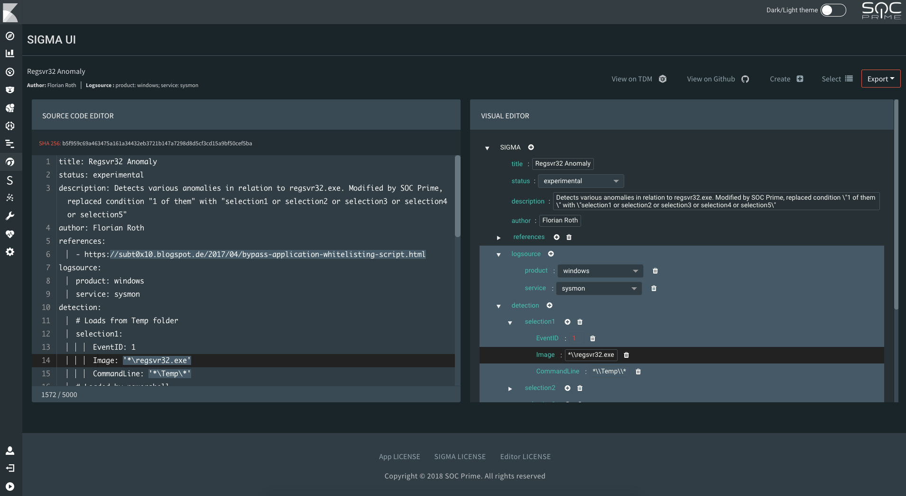

# Sigma UI
​
SIGMA UI is a free open-source application based on the Elastic Stack and Sigma Converter (sigmac). It streamlines the development, use, and sharing of Sigma, a generic rule format for SIEM systems. It is now possible to write, update, and export Sigma rules straight from the Kibana web UI for all supported Sigma back ends including: Azure Sentinel, Sumo Logic, Elastic Stack, Splunk, ArcSight, LogPoint, QRadar, Graylog, Regex Grep, Microsoft PowerShell, RSA NetWitness, Microsoft Defender ATP, Carbon Black, and Qualys. If you’re using the Elastic Stack for threat-hunting purposes or as a primary SIEM, SIGMA UI has capabilities to drill-down directly from a rule to a search in the **Discover** section of Kibana. Community Sigma rules are included with the application. Integration with the official Sigma GitHub and SOC Prime TDM repositories in on the short-term roadmap.​
​



​Sigma UI requires **Python 2.7** and the **sigmac** script to convert Sigma to different SIEM languages. The sigmac converter requires **Python 3.6** with the following library:
​
```sh
PyYAML>=3.11
```
Details: https://github.com/Neo23x0/sigma/tree/master/tools

## Installing the Sigma UI Plugin for Your Kibana ##

1. Copy the `sigma-ui-xxxxx.zip` file to the Kibana server and run the following command:
    ```sh
    /usr/share/kibana/bin/./kibana-plugin install file:///PATH_TO_FILE/sigma-ui-xxxxx.zip
    ```

    Wait until the installation finishes, it may take a few minutes to optimize and cache browser bundles. Restart Kibana using the systemctl restart kibana command to apply the changes.

        Note: If you get an error: "Plugin installation was unsuccessful due to error "Incorrect Kibana version in plugin [socprime_sigma_ui]. Expected [7.6.0]; found [6.6.1]", open the zip archive and modify the ./kibana/socprime_sigma_ui/package.json file by inserting the version of your Kibana to the kibana.version field.

2. Restart Kibana using the systemctl restart Kibana command to apply the changes.

        Note: If after restarting Kibana you don’t see any changes, go to /usr/share/kibana/optimize folder. Delete all files in this folder including subfolders. Then restart Kibana. This will make Kibana refresh its cache.

3. Create index templates for the following indices used by the Sigma UI plugin from the `index_template_sigma_ui.txt` file: 

        sui_config (to store app configs)
        sui_sigma_doc (for Sigma documents)
        
    a. Copy the ELK_import_export folder to the server that has access to the Elasticsearch database.  
    b. Modify the es_config.py script by providing your credentials:
    
        ES_host = ['localhost']
        ES_http_auth = None #('login', 'password')
        ES_port = 9200
        ES_scheme = "http" # "http" or "https"

    c. Run the following command:
    
        python /PATH_TO_FILE/import_es_index.py
        
    Indices will be created and filled with Sigma rules.

        Note: You should have the Elasticsearch module.
    
        For Python 2.7, install the Elasticsearch module using this command:
        pip install elasticsearch

4. You can receive Sigma rules from TDM using the TDM API:
    
    a. Extract the contents of the archive script_tdm_api.zip to your scripts folder, for example `/opt/scripts/`.   
    b. Install script dependencies in the script_tdm_api folder using the following command:

        pip install -Ur requirements.txt
     
     c. Specify your settings for the script processing in the `kibana/plugins/socprime_sigma_ui/config/common.json` file
     ```json
    {
        "debug": true,
        "max_upload_period_in_month": 2,
        "python_path": "/usr/bin/python3.6",
        "tdm_api_integration_tool_path": "/opt/scripts/script_tdm_api/tdm_api_for_sigma_ui.py",
         "tpm_sigma_folder_path": "/opt/scripts/script_tdm_api/sigmas"
    }
    ```

     This script gets new Sigma rules published at TDM using an API. The script uploads Sigma rules with the latest updated date in the `sui_sigma_doc` index. If the time range is greater than the values specified in `max_upload_period_in_month`, then it uses the `max_upload_period_in_month` value.
     
     This script gets all available Sigma rules for your Company registered at TDM.
     
     The script uses a temporary directory for storing data received from the TDM API. The path can be specified in the `tpm_sigma_folder_path` value. The received data is saved in the file in `*.json` format. 
     
     Meaning of other settings:

     * "debug": true 
     > Allow sending bugs/errors from the back end
     
     * "python_path": "/usr/bin/python3.6"
     > Path to the Python script
     
     * "tdm_api_integration_tool_path": "/opt/scripts/script_tdm_api/tdm_api_integration_tool.py"
     > Path to the script for updating the TDM Sigma rules using the TDM API


**Now you can use the Sigma UI plugin.**


## TO-Do
- [ ] Refactor the editor code as currently the file has an extensive size
- [X] Complete the SOC Prime TDM integration to pull new Sigmas via API
- [ ] Configure the GitHub integration to pull new Sigmas via API
- [ ] Add an auto-save feature and ability to save drafts
- [ ] Update tooltips for automatic spell-check
- [X] Populate dictionaries with more log sources
- [ ] Optimize the app back end for better performance
- [ ] Move all code from Python 2.7 to Python 3
